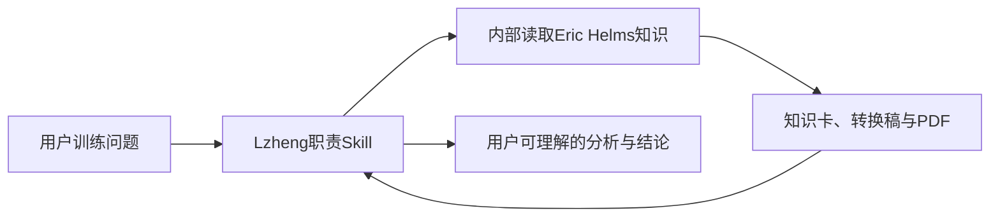

# Eric Helms 蒸馏项目与训练专家团扩展报告

## 1. 项目结论

本项目已完成从“单本训练书”到“可被 Lzheng 训练体系内部调用的专家知识模块”的结构转换。Eric Helms 不再是独立用户入口，不负责当前训练事实，也不属于 dbskill 或聊天室体系；其职责是为 Lzheng 的计划、周期、复盘、接回提供可追溯的 2018 年第二版训练金字塔原则。

最终调用链：



## 2. 已交付资产与边界

| 层级 | 已交付 | 作用 | 边界 |
| --- | --- | --- | --- |
| 原料 | PDF、288页规范转换稿、来源档 | 最终证据与可检索正文 | 不直接替代当前训练事实 |
| 整理 | 201节点矩阵、10张深卡、2张跨章决策、27条内部路由 | 覆盖、定位、推理 | 不向用户显示内部标签 |
| Lzheng接入 | 共用内部参考与四个 Skill 的按需读取点 | 将书本原则接入真实训练工作流 | 计划与日志仍由 Lzheng / Notion 决定 |
| 用户输出 | 专家声明、详细分析、结论、必要页码 | 可读、可行动、可追溯 | 不显示 route_id、文件路径或工程字段 |

## 3. 当前运行设计

### 3.1 四个职责入口

- `lzheng-fitness-plan`：依从性、频率、训练量、动作选择/排序、休息、节奏、从零建计划与样例计划改造。
- `lzheng-strength-cycle-planner`：RPE/RIR、渐进、训练年龄、周期化、减载、峰值、专项性、卡点与变式。
- `lzheng-strength-training-review`：适应—疲劳、表现波动与平台、加减量、自动调节、减载与力竭影响。
- `lzheng-training-return`：依从性、灵活安排、导入期、频率恢复与不照搬中断前重量。

四者共用 Eric Helms内部参考。该参考只保存调用条件、内部路由、来源优先级和输出隐藏规则；不复制书籍正文。

### 3.2 事实与知识分离

```text
当前事实：用户当次确认 > 当前 Notion > 当前执行基准 > 历史记录
书本原则：PDF > 规范名转换稿 > 深度卡 > 跨章节决策 > 框架/判断树
```

任何计划修改先由 Lzheng 读取当前事实，再用 Eric Helms 原则解释或约束决策。疼痛、术后、孕期和疾病不被本书原则转化为医疗处方。

## 4. 本次蒸馏流程复盘

### 做对的部分

1. 先固定来源：PDF 是最终证据，规范名转换稿是检索主源。
2. 将目录覆盖、章节知识、路由、判断树和回答协议分层，避免“一篇总笔记”承担全部职责。
3. 明确 2018 年第二版与作者当前观点、医疗边界和动态训练事实的边界。
4. 将用户输出与内部路由分开：工程字段只服务系统，不服务用户。

### 需要避免的部分

1. 不把“Skill 可加载”或显式调用当作自然语言自动触发成功。
2. 不以继承父对话的测试任务冒充独立测试；出现历史计划泄露时，该测试作废。
3. 不因单题测试反复重写知识正文；先汇总失败类型，再统一修复运行层。
4. 不把单本书专家设计成用户必须手动寻找的孤立工具；应先嵌入承担真实任务的主 Skill。

## 5. 后续书籍蒸馏标准流程

1. **立项**：确定人物、单一主源、版本边界、可回答范围与不可回答范围。
2. **来源层**：保存原件、生成唯一检索稿、连续页码标记、来源档和版权边界。
3. **知识层**：目录覆盖矩阵、问题导向知识卡、跨章决策、模型与安全边界。
4. **路由层**：内部问题映射、主次判断、必问信息、知识文件、页码和下游职责。
5. **接入层**：确定哪些 Lzheng Skill 在何种条件下读取该专家，不复制正文。
6. **输出层**：定义用户可见语言；隐藏内部路由、文件路径、测试字段与不必要的框架术语。
7. **验证层**：先静态检查来源、覆盖、链接、路由；再按真实入口测试用户体验、动态事实边界和安全边界。
8. **封版层**：只在静态与接入测试均通过后更新状态、索引与日志。

## 6. 未来训练专家团设计

未来增加人物时，专家团是 **Lzheng 内部的知识选择器**，不是聊天室，也不是多 Agent 并行辩论。

### 6.1 准入条件

每位人物须有：可合法使用的主源、明确版本、可复核页码或段落、独立的适用变量、与现有人物不重复的贡献，以及明确的时代与安全边界。

### 6.2 自动选择 2–3 位专家

在 Lzheng 已完成任务分类后，内部按“问题变量覆盖”选择最少的 2–3 位专家：

1. 先排除不适用者：版本过期、超出人物范围、医疗或事实不足。
2. 选择一位处理主变量的专家。
3. 只有存在第二个独立变量或重要取舍时，加入第二位；仍有未覆盖的关键冲突才加入第三位。
4. 同一原则有冲突时，按来源质量、版本、适用人群与用户当前事实处理，不以投票决定。
5. 用户仍只看到一份由 Lzheng 整合的详细分析和结论；可在必要时标注“依据了哪些来源”，但不展示内部投票或路由过程。

> [!warning] 不要为了“专家团”固定凑满三人。只有一个专家覆盖问题时，只调用一个；2–3 人是上限，不是配额。

### 6.3 未来共用路由契约

未来应新增一个 Lzheng 内部“训练专家索引”，每位专家只登记：人物/版本、擅长变量、排除条件、主源位置、接入的 Lzheng Skill、输出边界和验证状态。专家正文仍留在各自知识库项目，索引不复制正文。

## 7. 下一步

1. 完成 12项Lzheng内部接入测试。
2. 测试通过后将 Eric Helms 状态恢复为“已完成蒸馏”。
3. 新增第二位人物前，先按本报告第5节建立独立蒸馏项目；只有两位专家均通过接入测试后，才建设“训练专家索引”和 2–3 人内部选择规则。

## 8. 可复用执行入口

后续新专家、专家团和旧项目整改统一使用 multi-expert-distiller。该 Skill 将本报告流程压缩为“一次性立项问诊 → 唯一来源 → 知识与判断 → 主系统接入 → 分层验证”，默认隐藏内部路由，并且只在用户明确要求时验证自然语言自动触发。
